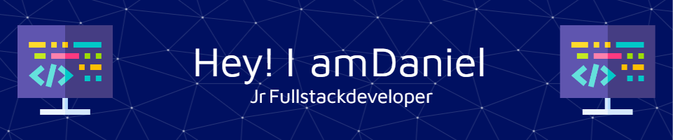

 

<h3> 👨🏻•💻 About Me </h3>

- 🤔 &nbsp; Learning new technologies and creating solutions while making new Friends

- 🎓 &nbsp; Studied in Universidad Tecnologica Nacional FRBA (Argentina).

- 🌱 &nbsp; Coding in Js & dreaming in REACT.

- ✍️ &nbsp; Persuing my dreamjob as a Jr web developer.

<h3>🛠 Tech Stack</h3>

- 🌐 &nbsp; JavaScript | Tailwind | React | Redux | ExpressJS 

- 🛢 &nbsp; SQL | NodeJs | Sequelize | MongoDB

<h3>🛠 I'm Ready To Learn</h3>

- 🔧 &nbsp; Golang | Docker🐳 | Firebase

  

 

 

  

<h3> 🤝🏻 Connect with Me, Im allways happy to make new friends </h3>

 

